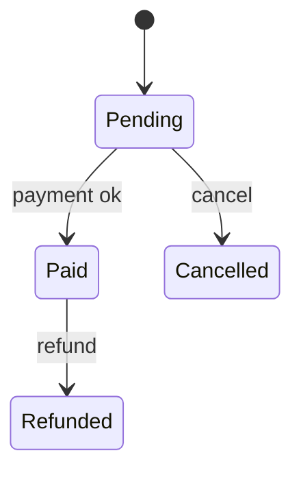

# /qa-scenarios — Generate test scenarios for QA from your changes

Turn a diff into a **manual-QA handoff document**: a plain-language description of what the change does _as a tester experiences it_, followed by concise, runnable test scenarios. The audience is a manual tester, so the document is **black-box and jargon-free** — it never references code internals, architecture, or implementation detail.

This is a **standalone** skill. It needs no plans, specs, or task artifacts, works on any repo, and **never edits source** — it reads the change and writes one handoff document.

**Reads:** the change (a `gh` PR or a local branch diff against the base, plus uncommitted working-tree changes), and enough of the surrounding code to understand the _behavior_ that changed.
**Produces:** one document at `specs/qa/{slug}.md`, plus a chat summary.

## What makes a good handoff here

1. **Tester's perspective, not the author's.** Describe observable behavior — inputs, outcomes, states, configurations — never how it's built.
2. **Understand before you enumerate.** The scenarios are only as good as the understanding of what changed and what it can affect.
3. **Cover the change _and_ its blast radius.** The literal diff plus the adjacent user-facing flows it could regress.
4. **Concise but complete.** Every case is atomic and runnable; shared setup is factored out, not repeated.

## Process

### Step 1: Resolve the change and the base

1. **Source of the change:**
   - **`gh` PR (number or URL)** → `gh pr view <id> --json title,body,headRefName,baseRefName` for context and `gh pr diff <id>` for the committed diff. If `gh` is unavailable, say so and use the local-branch path.
   - **Local branch** (explicit name, or the current branch) → diff it against the base.
2. **Base branch:** the PR's `baseRefName` when known; otherwise auto-detect `main` or `master`; honor an explicitly stated base.
3. **Establish the full change set:** `git diff <base>...<head>` (three-dot, against the merge-base) **plus uncommitted working-tree changes** (`git diff` and `git diff --staged`, and `git status` for new files). Generating scenarios before pushing is a first-class case — fold the working tree in.
4. If there's no change to analyze or the source can't be resolved, stop and report what's missing.

### Step 2: Understand the change (internal)

Read the diff and enough of the **surrounding code** (callers, callees, sibling flows, config/feature-flag usage) to answer: _what behavior does this add, change, or remove, and what does a user/tester observe?_ This stage is internal — it feeds the description but is never shown as technical detail.

### Step 3: Map the affected flows

Identify the **changed behavior** plus the **directly affected adjacent flows** that could regress — a shared component, endpoint, or setting the change touches that other user-facing features rely on. These become the regression scenarios in Step 6.

### Step 4: Write the change description (flexible, reader-first)

Write a jargon-free description of what the change does for a tester. **There is no fixed structure** — choose the shape that communicates this particular change most clearly:

- short prose for a simple change;
- **subsections and bullet lists** when the change has distinct parts or several user-facing areas;
- a **Mermaid diagram** when the logic warrants a picture over words — a state machine, a decision/branching flow, an order of operations, or how a value moves through a process;
- grouping by user-facing area when the change spans several.

Lead with what a tester can observe (inputs → outcomes, states, configurations, messages). Include a diagram or breakdown **only when the logic is complex enough to need it** — don't decorate a simple change. Never include code, type names, or architecture.

### Step 5: Plan coverage

Before writing cases, enumerate the dimensions this change calls for — so coverage is deliberate, not accidental:

- **Happy path** (positive) for each new/changed behavior.
- **Negative / invalid input** — wrong types, missing required fields, malformed values.
- **Boundary / edge values** — empty, zero, max, just-over-limit, very long, special characters.
- **Variants & configurations** — feature flags, settings, environments, plan tiers that change behavior.
- **Roles / permissions** — different user types or access levels, including unauthorized.
- **State transitions** — behavior across the relevant states of the affected entity.
- **Error handling & messaging** — what the tester should see when something fails.
- **Regression of affected flows** (from Step 3) — confirm adjacent features still work.

Skip a dimension only when it genuinely doesn't apply to this change; don't pad with irrelevant cases.

### Step 6: Factor out reusable setup, then write the scenarios

To keep scenarios concise and free of duplication, define shared pieces **once** in a **Test setup** section, each with a short ID, then reference them by ID. Only promote something to a reusable block when **two or more cases share it** — no premature abstraction for one-off steps.

- **Preconditions** — `P1: Logged in as admin with an active order`
- **Test data** — `D1: Order #1001 (paid, 2 items)`
- **Reusable flows** (a recurring step block) — `F1: Orders → open order → Refund`

Group cases into **scenarios** by user-facing area. A scenario may declare shared context (`Applies to all cases: P1, D1`) that every case under it inherits. Each **test case** is atomic — one behavior — and lists only its own delta:

- A case's effective context = the scenario-inherited blocks **+** the case's own `Also needs:` and delta steps.
- Each case stays independently runnable: a tester resolves the referenced IDs from the **Test setup** section.
- Cover the dimensions from Step 5; give each case a **Priority** (High/Medium/Low) to help QA triage.

Steps are written the way a tester actually exercises the change — UI clicks, API calls, or CLI commands depending on what changed — always black-box.

### Step 7: Write the document

Write to `specs/qa/{slug}.md` (slug from the PR number/title or branch; create `specs/qa/` if absent):

````markdown
# Test Scenarios: <title>

**Source:** PR #123 (or branch `feature/x`) · **Base:** main · **Date:** YYYY-MM-DD
**Scope:** <areas covered>

## What changed

[Flexible, jargon-free description — prose, lists, subsections, and/or a Mermaid
diagram as the logic warrants. Lead with observable behavior. Example when a diagram helps:]



## Affected areas to retest

[Adjacent flows that could regress because of this change.]

## Test setup

**Preconditions:** P1 = … · P2 = …
**Test data:** D1 = … · D2 = …
**Flows:** F1 = … · F2 = …

## Test scenarios

### Scenario 1: <area / behavior>

_Applies to all cases:_ P1, D1

**TC1.1 — <title>** · Priority: High

- Also needs: P2
- Steps:
  1. F1 → <delta step>
  2. …
- Expected result: <observable outcome>

**TC1.2 — <title> (negative)** · Priority: Medium

- Steps:
  1. …
- Expected result: <blocked with message / unchanged state>

### Scenario 2: <area / behavior>

…
````

### Step 8: Self-review the document

Read it with fresh eyes and fix it inline before handing off:

1. The description is jargon-free and would make sense to someone who hasn't seen the code; any diagram is accurate and earns its place.
2. Every test case is **atomic** (one behavior) and has an explicit **expected result**.
3. The coverage dimensions from Step 5 were actually addressed (or deliberately, defensibly skipped) — especially negatives, boundaries, and the affected-flow regressions.
4. Reusable blocks are referenced consistently; every referenced ID (`P1`, `D1`, `F1`) is defined in **Test setup**, and nothing reused is left duplicated inline.
5. Scenarios stay within the change's blast radius — no scenarios for behavior this change doesn't touch.

### Step 9: Summarize and hand off

Print a tight summary:

```text
specs/qa/<slug>.md            [created]
Scenarios: N   ·   Cases: M   ·   Areas: <list>
```

Then offer to continue collaboratively — you decide what your QA team needs:

- **Expand coverage** for a specific area or dimension (more negatives, more configurations).
- **Adjust depth / priority** — trim to the essentials, or go deeper on a risky area.
- **Add variants** you know matter from product context I can't see.
- **Reformat** for your QA tool — a paste-ready table, Gherkin Given/When/Then, or a CSV-style export.

Stop after the summary and offer — don't chain automatically.

## Notes

- **Standalone.** No plans, specs, or task artifacts; no status to advance. Works on any repo, including ones with no prior workflow setup.
- **Black-box, jargon-free.** The document is for a manual tester — observable behavior only, never code or architecture detail.
- **Flexible description.** What-changed is shaped to fit the change (prose / lists / subsections / diagram), not forced into fixed headings; a diagram appears only when the logic needs one.
- **Factor, don't repeat.** Shared preconditions, data, and step flows live once in **Test setup** and are referenced by ID; promote a block only when ≥2 cases use it.
- **Cover the blast radius.** Test the changed behavior and the adjacent flows it could regress — not the whole feature, and not just the literal diff.
- **Never edits source.** It reads the change and writes the handoff document; that's all.
