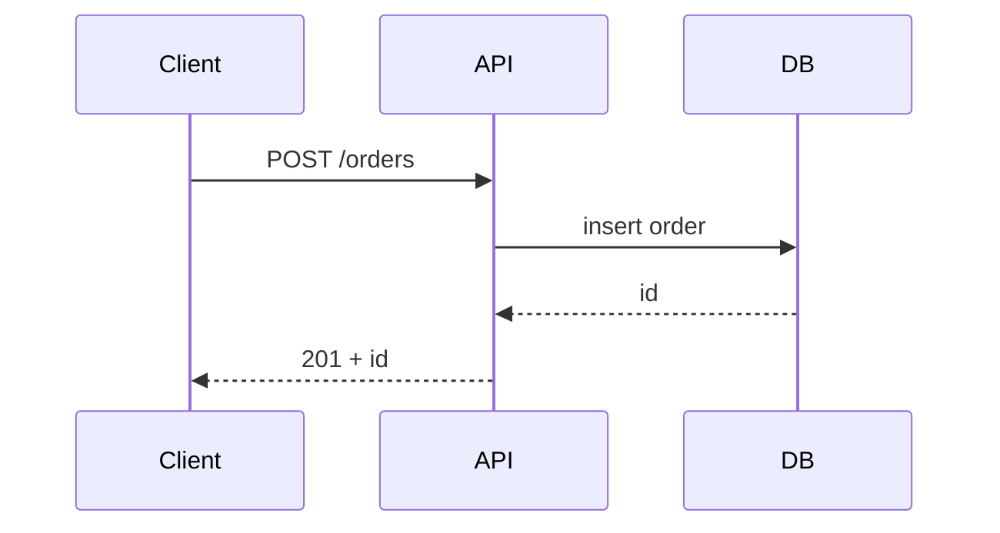

# /review-pr — Review someone else's pull request

Support **you, the reviewer**, in reviewing another author's pull/merge request. The skill resolves the change, builds a real understanding of it, stress-tests the solution, and writes a report whose first half **explains the change** (walkthrough + diagrams) and whose second half **lists findings**. You then act on the report — discuss it with me, refine findings you're unsure about, and post comments to the author.

This skill is for the **reviewer's** seat: it analyzes and reports, it **never edits source**, and it never points at a "fix" step — the author owns the fix. There are no plans, specs, or task artifacts here; this is a standalone skill outside the task pipeline.

**Reads:** the PR/MR metadata via `gh`/`glab`, the checked-out local branch diff, the surrounding code the change touches, `specs/workflow-config.md`'s Coding standards section if present, and repo rules (`CLAUDE.md` / `AGENTS.md` / `.cursor/rules`).
**Produces:** one report at `specs/reviews/{pr-slug}.md`, plus a chat summary and a collaborative follow-up.

## What makes a good PR review here

1. **Understand before you judge.** The report leads with intent and a walkthrough of the change — what it does and how — so findings land in context. You read to understand first, then read the findings.
2. **Evidence over opinion.** Every finding names a `file:line` and the concrete risk, and carries a **confidence** so you can weigh how hard to push on it.
3. **Grill the design.** Complexity that isn't paying for itself is a finding. Ask whether a materially simpler approach exists before accepting the one on the table.
4. **Measure against the repo's own standards**, degrading gracefully when this isn't your project.

## Severity

- **Blocker:** Must change before merge. Correctness bug, security hole, data-safety risk, broken behavior.
- **Major:** Should change. Reliability, design, or standards problem that will bite later.
- **Minor:** Optional. Nits and small suggestions — record them, but they don't gate the merge.

**Confidence (per finding):** High (verified against the code) · Medium (likely, some assumption) · Low (worth raising as a question, may be a false positive — you decide whether to surface it).

**Verdict** maps to the PR review actions: **Request changes** on any Blocker · **Comment** on one or more Majors · **Approve** otherwise.

## Process

### Step 1: Resolve the change and the base

1. **Source of the change:**
   - **`gh` PR (number or URL)** → use `gh pr view <id> --json title,body,headRefName,baseRefName,author,url` for metadata/context, then check out the branch locally with `gh pr checkout <id>`. Do **not** use `gh pr diff`, `gh pr view --json files`, or remote file/diff APIs as the review input.
   - **`glab` MR (number or URL)** → use `glab mr view <id>` (JSON fields when available: title, description, source branch, target branch, author, web URL) for metadata/context, then check out the source branch locally with `glab mr checkout <id>` or the repository's equivalent `git fetch` + `git switch`. Do **not** use `glab mr diff`, MR file lists, or remote file/diff APIs as the review input.
   - **Local branch** (explicit name, or the current branch) → switch to that branch if needed, then diff it against the base.
2. **Base branch:** use the PR's `baseRefName` when known; otherwise auto-detect `main` or `master`; honor an explicitly stated base when the user names one.
3. **Preserve local workflow/spec work before checkout:** inspect `git status --porcelain`. If there are uncommitted local changes in `specs/`, `.claude/`, `.cursor/`, `CLAUDE.md`, `AGENTS.md`, or other workflow artifacts, treat them as the reviewer's local workspace, not part of the PR/MR. Do not stage, commit, discard, or review them. Let the checkout carry them when possible; if checkout would overwrite them, stash only those paths, check out the PR/MR branch, then immediately re-apply the stash so they remain uncommitted.
4. **Establish the diff locally after checkout:** `git diff <base>...HEAD` (three-dot, to compare against the merge-base, not unrelated base movement). Capture the file list and the full diff from the local repo only, excluding uncommitted workflow/spec artifacts from the review context.
5. If the diff is empty or the source can't be resolved, stop and report what's missing — don't guess.

### Step 2: Build understanding

This is the foundation of the report, not an afterthought.

1. Read the PR description / title for the author's stated intent (when available).
2. Read the diff in full, then read enough of the **surrounding code** the change touches (callers, callees, sibling modules) to understand how it fits — a diff in isolation hides intent and breakage.
3. Form a clear answer to: *what does this PR do, how does it work, and what's the data/control flow through the changed code?* Note where a diagram would explain it faster than prose (data flow, a request/sequence path, or how components now connect).

### Step 3: Load the standards to measure against

1. Read `specs/workflow-config.md`'s Coding standards section if it exists, plus repo rules (`CLAUDE.md` / `AGENTS.md` / `.cursor/rules`).
2. If `specs/` is absent (this is the author's project, not yours), **degrade gracefully**: rely on repo rules and the idioms inferred from 1–2 neighboring files. Don't invent standards the project doesn't hold itself to.

### Step 4: Analyze across dimensions

Scan the change against each dimension and collect findings:

- **Correctness & Bugs** — logic errors, mishandled edge cases, missing/incorrect error handling, off-by-ones, races, broken assumptions about inputs.
- **Safety & Quality** — security (injection, secrets in code, missing authz at boundaries, unsafe deserialization), performance (N+1, unbounded loops/allocations, missing pagination), reliability (unhandled failures at external boundaries, resource leaks), data safety (destructive ops, unsafe migrations).
- **Design & Complexity (the grill)** — is the approach more complex than the problem requires? Needless abstraction, premature generalization, layers that don't earn their keep, duplication that should be shared, or a shape that fights the codebase. Actively ask whether a **materially simpler alternative** exists and, if so, describe it. Equally, don't manufacture complexity concerns where the code is appropriately simple.
- **Coding Standards & Repo Rules** — concrete violations of the standards loaded in Step 3.
- **Pattern Consistency** — compare against 1–2 similar existing files; flag substantive mismatches (naming, layering, error handling, module boundaries), not trivial formatting.
- **Test Coverage** — are the changed behaviors covered? Do the tests assert real behavior rather than mocks echoing themselves? Are meaningful edge cases tested?

Be precise: "`src/auth/handler.ts:42` — SQL built by string concatenation from `req.query.id`, injectable" — not "possible security issue". Consolidate related nits instead of padding the list. Where you're inferring rather than certain, mark the finding's confidence accordingly rather than overstating it.

### Step 5: Optional read-only checks

If the branch is checked out and the project's checks are obvious (lint / typecheck / tests), you may run them **read-only** as evidence and record pass/fail with relevant output. Never mutate the working tree, index, or HEAD. Skip this silently when it isn't applicable — it's evidence, not a gate.

### Step 6: Write the report

Write to `specs/reviews/{pr-slug}.md` (slug from the PR number/title or branch name; create `specs/reviews/` if absent). **Understanding first, findings second** — embed Mermaid diagrams in the understanding section wherever they explain the change faster than prose.

````markdown
# PR Review: <title>

**Source:** PR #123 (or branch `feature/x`)  ·  **Base:** main  ·  **Author:** <name>
**Date:** YYYY-MM-DD
**Verdict:** Approve | Comment | Request changes
**Findings:** N blockers · N majors · N minors

## What this PR does

[The author's intent in 1–2 sentences, then a grounded walkthrough of the change:
the key pieces, how they fit together, and the data/control flow through them.
Written so a reader understands the change before seeing any finding.]

### Diagrams

[Embed the diagram(s) that explain the change — only those that genuinely help.
Use Mermaid: `flowchart` for data flow, `sequenceDiagram` for a request/call path,
`graph`/component view for how modules now connect.]



## Dimension verdicts

| Dimension              | Verdict           |
| ---------------------- | ----------------- |
| Correctness & Bugs     | PASS/WARNING/FAIL |
| Safety & Quality       | PASS/WARNING/FAIL |
| Design & Complexity    | PASS/WARNING/FAIL |
| Coding Standards       | PASS/WARNING/FAIL |
| Pattern Consistency    | PASS/WARNING/FAIL |
| Test Coverage          | PASS/WARNING/FAIL |

## Verification (if run)

[Each read-only check → pass/fail, with output for failures. Omit if none were run.]

## Findings

[Sorted Blocker → Major → Minor. Omit a severity group when empty.
If there are no findings, say so and give the Approve verdict.]

### F1 — [short title]

- **Severity:** Blocker | Major | Minor
- **Confidence:** High | Medium | Low
- **Dimension:** Safety & Quality
- **Location:** `path/to/file.ts:42`
- **Finding:** What's wrong, with evidence from the code.
- **Why it matters:** The concrete risk or cost if merged as-is.
- **Suggestion:** What you'd raise with the author — a concrete change or a simpler
  alternative. Where there's a real tradeoff, give two options as
  `[approach] · Strength: [advantage] · Tradeoff: [cost]` and mark one `⭐ Preferred`.

## Open questions for the author

[Genuine uncertainties — things that look wrong but might be intentional given context
you don't have. Phrase as questions to ask, not assertions.]
````

### Step 7: Self-review the report

Read the report with fresh eyes and fix it inline before handing off:

1. The understanding section actually explains the change — a reader gets it before reaching the findings.
2. Diagrams are accurate to the code and earn their place (no diagram for diagram's sake).
3. Every finding has a real `file:line`, evidence, a non-obvious "why it matters", and an honest confidence.
4. The verdict matches the thresholds (any Blocker → Request changes; any Major → Comment; else Approve).
5. Design/complexity findings propose a concrete simpler path rather than just asserting "too complex".

### Step 8: Hand off and collaborate

Print a tight summary:

```text
specs/reviews/<slug>.md      [created]
Verdict: <Approve | Comment | Request changes>
Findings: <N blockers · N majors · N minors>
```

Then offer to continue **with you, collaboratively** — you're the reviewer deciding what to post, so this is discussion, not a fix queue:

- **Explain deeper** — walk through any part of the change in more detail.
- **More diagrams** — add or refine a data-flow / sequence / component view.
- **Challenge a finding** — push back where you disagree or where my confidence is Low; I'll re-examine, downgrade, or withdraw it. Low-confidence items are candidates to drop, not facts.
- **Phrase comments** — help word the feedback you'll leave on the PR.

Stop after the summary and offer — don't chain anything automatically.

## Notes

- **Reviewer's seat.** This skill never edits source and never points at a fix step — the author fixes; you review. Its output is feedback you decide what to do with.
- **Understanding leads.** The report is ordered so the change is explained before it's critiqued. Diagrams live in that understanding section, in the report itself — not just in chat.
- **Standalone.** No plans, specs, task artifacts, or status to advance. It works on any repo, including ones with no `specs/` directory.
- **Evidence and honest confidence.** Name a location and a concrete risk for every finding; mark how sure you are. An overconfident false positive wastes the author's time and yours.
- **Grill, don't nitpick.** Real design and complexity concerns with a simpler alternative are high-value; style preferences that don't matter are Minor at most.
- **The base matters.** Diff with three dots against the merge-base so unrelated movement on the base branch doesn't pollute the change set.
